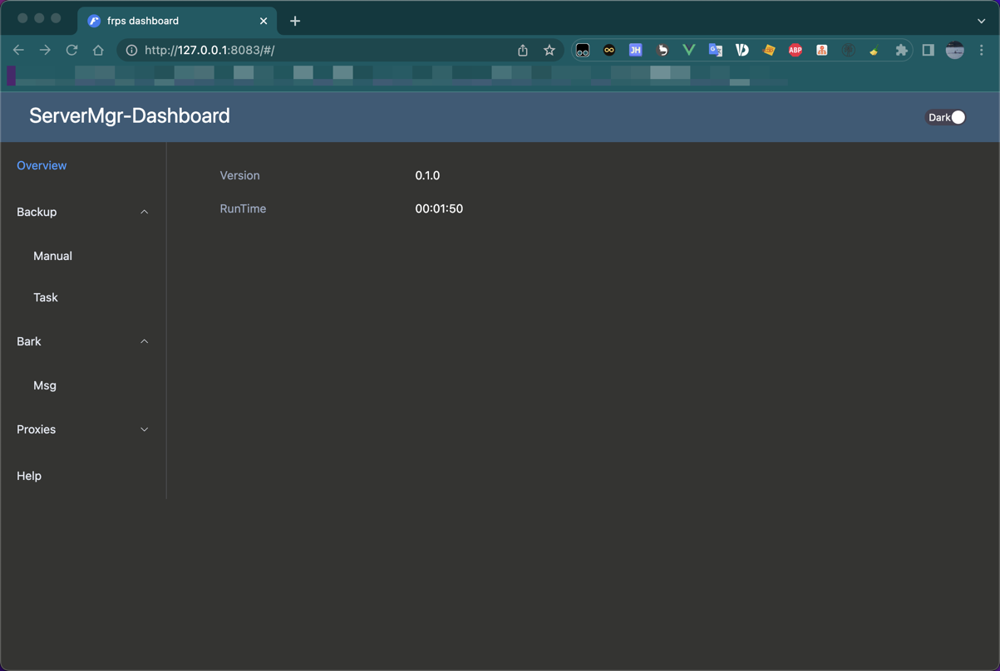

# server-mgr


[README](README.md) | [中文文档](README_zh.md)

server-mgr is a family private server management application, including flexible resource backup strategy, Apple bark application message notification, email notification, server monitoring, etc.

## why server-mgr？

Deploy server-mgr on your home server, server-mgr can help you:

* Eliminate the need to buy expensive disk arrays.
* Keep family data safe with minimal resources.
* The bark application message and email will push the server status in real time.
* Server Status Monitoring.
* Provide server management page.
* Support Docker rapid deployment.

## development status

The current version 0.1.0 already supports the local file backup function(Support manual or task).

Subsequent functions will be developed in succession in the future.

Since there is only one person developing the project for the time being, subsequent iterations will be slower, please forgive me.

## Quick start

### Entry

To install docker, please refer to [docker doc](https://docs.docker.com/get-started/)

You can directly execute the following command without any action to experience it:
```
docker run -it -d --restart=always --name server-mgr newbiebo/server-mgr:0.1.0
```
### Further

We recommend that you expose the port and mount the data and log file:
```
docker run -it -d --restart=always --name server-mgr -p 8023:8023 -v ${PWD}/db:/home/server-mgr/db -v ${PWD}/log:/home/servermgr/log newbiebo/server-mgr:0.1.0
```
## Dashboard

The dashboard is not open source, please email me if you want to use it！

Don't worry, interface usage is provided.[Click see detail](RestApi.http)

[server-mgr-web](https://github.com/newbiebo/server-mgr-web/tree/master)



## Is it any good?

Yes.

_When people first hear about a new product, they frequently ask if it is any good. A Hacker News user
[remarked](https://news.ycombinator.com/item?id=3067434):_

> Note to self: Starting immediately, all raganwald projects will have a “Is it any good?” section in the readme, and
> the answer shall be “yes.".

So, we follow the tradition...

## Is it awesome?

[These people](https://github.com/newbiebo/server-mgr/stargazers) seem to like it.

## Email Me

📫:1186644190wxb@gmail.com

## status


